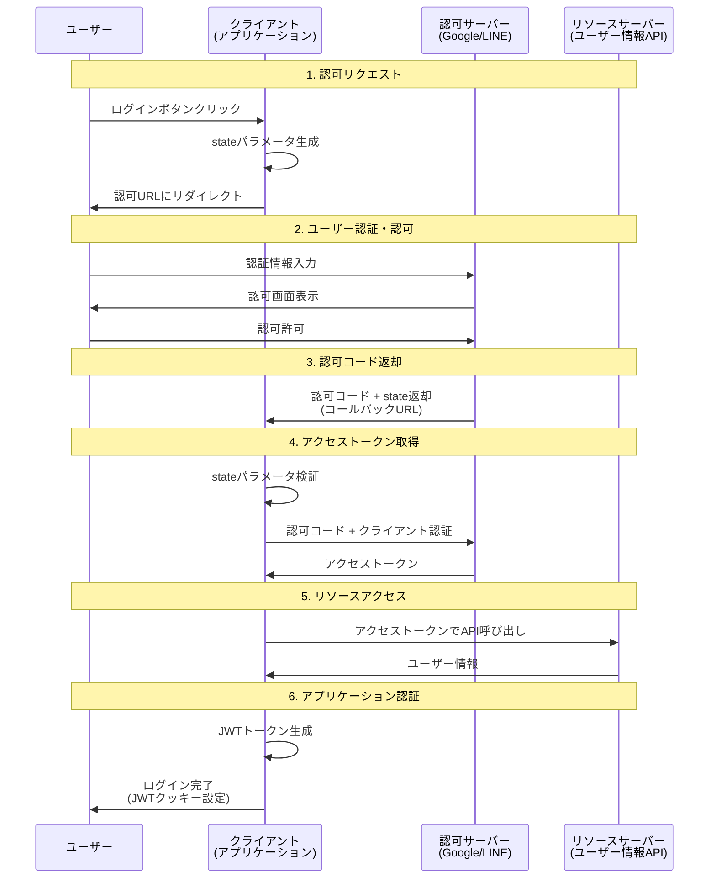
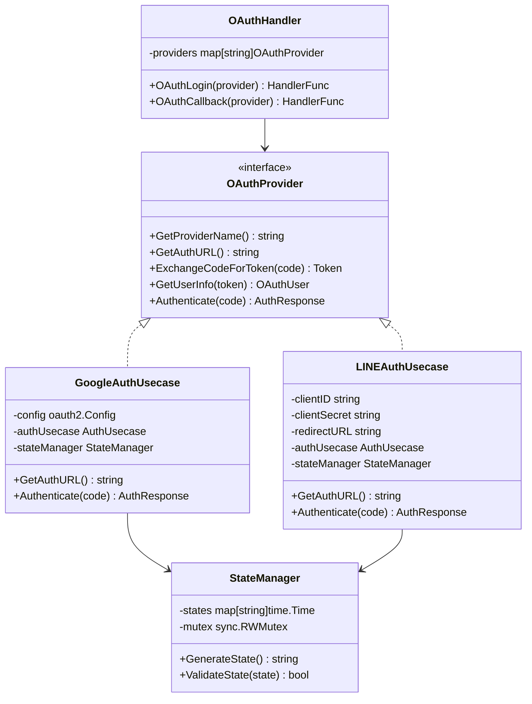

# OAuth 2.0 認可コードフロー 実装ガイド

## 概要

本ドキュメントでは、Go Echo Demo プロジェクトで実装されているOAuth 2.0 認可コードフローについて、図解とコード例を交えて詳しく解説します。

現在、Google OAuthとLINE OAuthに対応しており、統合されたインターフェースによる拡張可能な設計となっています。

## OAuth 2.0 認可コードフローとは

OAuth 2.0 認可コードフローは、第三者アプリケーションがユーザーの代理でリソースにアクセスするための標準的な認証・認可フローです。

### 主な特徴

- **セキュア**: クライアントシークレットがフロントエンドに露出しない
- **標準準拠**: RFC 6749に準拠した実装
- **CSRF対策**: stateパラメータによる攻撃対策
- **スコープ制御**: 必要最小限の権限でアクセス

## フローの全体像



## 実装アーキテクチャ

### レイヤー構成

```
┌─────────────────┐
│   Frontend      │ ← ログインページ、ボタン
├─────────────────┤
│   Handler       │ ← HTTP エンドポイント
├─────────────────┤
│   UseCase       │ ← ビジネスロジック
├─────────────────┤
│   Repository    │ ← データ永続化
├─────────────────┤
│ Infrastructure  │ ← 外部API、設定
└─────────────────┘
```

### コンポーネント関係図



## ステップ別実装詳細

### Step 1: 認可リクエストの開始

#### 1.1 ログインページの表示

```go
// templates/login.html
<div class="oauth-buttons">
    <!-- Google OAuth ボタン -->
    <a href="/auth/google" class="oauth-button google">
        
        Googleでログイン
    </a>
    
    <!-- LINE OAuth ボタン -->
    <a href="/auth/line" class="oauth-button line">
        
        LINEでログイン
    </a>
</div>
```

#### 1.2 認可URL生成

```go
// internal/handler/api/oauth.go
func (h *OAuthHandler) OAuthLogin(providerName string) echo.HandlerFunc {
    return func(c echo.Context) error {
        // プロバイダーを取得
        provider, exists := h.providers[providerName]
        if !exists {
            return echo.NewHTTPError(http.StatusNotFound, "Provider not found")
        }

        // 認可URLを生成（stateパラメータを含む）
        authURL := provider.GetAuthURL()
        
        // 認可サーバーにリダイレクト
        return c.Redirect(http.StatusTemporaryRedirect, authURL)
    }
}
```

#### 1.3 Google認可URL生成

```go
// internal/usecase/google_auth.go
func (u *GoogleAuthUsecase) GetAuthURL() string {
    // CSRFプロテクション用のstateパラメータを生成
    state := u.stateManager.GenerateState()
    
    // OAuth2ライブラリを使用してURLを構築
    return u.config.AuthCodeURL(state)
}
```

生成されるURL例:
```
https://accounts.google.com/o/oauth2/auth?
  client_id=YOUR_CLIENT_ID&
  redirect_uri=http://localhost:8080/auth/google/callback&
  response_type=code&
  scope=openid+email+profile&
  state=RANDOM_STATE_VALUE
```

#### 1.4 LINE認可URL生成

```go
// internal/usecase/line_auth.go
func (u *LINEAuthUsecase) GetAuthURL() string {
    // CSRFプロテクション用のstateパラメータを生成
    state := u.stateManager.GenerateState()
    
    // LINE OAuth2 URLを手動構築
    baseURL := "https://access.line.me/oauth2/v2.1/authorize"
    params := url.Values{}
    params.Set("response_type", "code")
    params.Set("client_id", u.clientID)
    params.Set("redirect_uri", u.redirectURL)
    params.Set("state", state)
    params.Set("scope", u.scopes)
    
    return baseURL + "?" + params.Encode()
}
```

### Step 2: ユーザー認証と認可

この段階はOAuthプロバイダー（Google/LINE）側で実行されます：

1. **ユーザー認証**: ユーザーがGoogle/LINEアカウントでログイン
2. **認可確認**: アプリケーションがリクエストした権限の許可確認
3. **認可決定**: ユーザーが許可または拒否を選択

### Step 3: 認可コードの受け取り

#### 3.1 コールバックエンドポイント

```go
// internal/handler/api/oauth.go
func (h *OAuthHandler) OAuthCallback(providerName string) echo.HandlerFunc {
    return func(c echo.Context) error {
        // プロバイダーを取得
        provider, exists := h.providers[providerName]
        if !exists {
            return echo.NewHTTPError(http.StatusNotFound, "Provider not found")
        }

        // 認可コードとstateパラメータを取得
        code := c.QueryParam("code")
        state := c.QueryParam("state")
        
        // 必須パラメータの検証
        if code == "" {
            return echo.NewHTTPError(http.StatusBadRequest, "Authorization code is required")
        }

        // プロバイダー固有の認証処理を実行
        authResponse, err := provider.Authenticate(code, state)
        if err != nil {
            return echo.NewHTTPError(http.StatusUnauthorized, err.Error())
        }

        // JWTトークンをHTTPOnlyクッキーに保存
        h.setAuthCookie(c, authResponse.Token)
        
        // 保護されたページにリダイレクト
        return c.Redirect(http.StatusTemporaryRedirect, "/protected")
    }
}
```

### Step 4: アクセストークンの取得

#### 4.1 Google トークン交換

```go
// internal/usecase/google_auth.go
func (u *GoogleAuthUsecase) ExchangeCodeForToken(code string) (*oauth2.Token, error) {
    // コンテキストを作成
    ctx := context.Background()
    
    // OAuth2ライブラリでトークン交換
    token, err := u.config.Exchange(ctx, code)
    if err != nil {
        return nil, fmt.Errorf("failed to exchange code for token: %w", err)
    }
    
    return token, nil
}
```

#### 4.2 LINE トークン交換

```go
// internal/usecase/line_auth.go
func (u *LINEAuthUsecase) ExchangeCodeForToken(code string) (*oauth2.Token, error) {
    // LINE Token APIへのリクエストを構築
    data := url.Values{}
    data.Set("grant_type", "authorization_code")
    data.Set("code", code)
    data.Set("redirect_uri", u.redirectURL)
    data.Set("client_id", u.clientID)
    data.Set("client_secret", u.clientSecret)

    // HTTP POSTリクエストを送信
    resp, err := http.PostForm("https://api.line.me/oauth2/v2.1/token", data)
    if err != nil {
        return nil, fmt.Errorf("failed to make token request: %w", err)
    }
    defer resp.Body.Close()

    // レスポンスをパース
    var tokenResp struct {
        AccessToken  string `json:"access_token"`
        TokenType    string `json:"token_type"`
        RefreshToken string `json:"refresh_token"`
        ExpiresIn    int    `json:"expires_in"`
        Scope        string `json:"scope"`
    }

    if err := json.NewDecoder(resp.Body).Decode(&tokenResp); err != nil {
        return nil, fmt.Errorf("failed to decode token response: %w", err)
    }

    // oauth2.Token形式に変換
    token := &oauth2.Token{
        AccessToken:  tokenResp.AccessToken,
        TokenType:    tokenResp.TokenType,
        RefreshToken: tokenResp.RefreshToken,
        Expiry:       time.Now().Add(time.Duration(tokenResp.ExpiresIn) * time.Second),
    }

    return token, nil
}
```

### Step 5: ユーザー情報の取得

#### 5.1 Google ユーザー情報取得

```go
// internal/usecase/google_auth.go
func (u *GoogleAuthUsecase) GetUserInfo(token *oauth2.Token) (*domain.OAuthUser, error) {
    // Google OAuth2 APIクライアントを作成
    ctx := context.Background()
    oauth2Service, err := googleoauth2.NewService(ctx, 
        option.WithTokenSource(u.config.TokenSource(ctx, token)))
    if err != nil {
        return nil, fmt.Errorf("failed to create oauth2 service: %w", err)
    }

    // ユーザー情報を取得
    userInfo, err := oauth2Service.Userinfo.Get().Do()
    if err != nil {
        return nil, fmt.Errorf("failed to get user info: %w", err)
    }

    // ドメインオブジェクトに変換
    return &domain.OAuthUser{
        ID:            userInfo.Id,
        Email:         userInfo.Email,
        Name:          userInfo.Name,
        Picture:       userInfo.Picture,
        VerifiedEmail: userInfo.VerifiedEmail,
        Provider:      "google",
    }, nil
}
```

#### 5.2 LINE ユーザー情報取得

```go
// internal/usecase/line_auth.go
func (u *LINEAuthUsecase) GetUserInfo(token *oauth2.Token) (*domain.OAuthUser, error) {
    // LINE Profile APIにリクエスト
    req, err := http.NewRequest("GET", "https://api.line.me/v2/profile", nil)
    if err != nil {
        return nil, fmt.Errorf("failed to create request: %w", err)
    }

    // Authorizationヘッダーにアクセストークンを設定
    req.Header.Set("Authorization", "Bearer "+token.AccessToken)

    // HTTPクライアントでリクエストを送信
    client := &http.Client{Timeout: 10 * time.Second}
    resp, err := client.Do(req)
    if err != nil {
        return nil, fmt.Errorf("failed to get user info: %w", err)
    }
    defer resp.Body.Close()

    // レスポンスをパース
    var profile struct {
        UserID        string `json:"userId"`
        DisplayName   string `json:"displayName"`
        PictureURL    string `json:"pictureUrl"`
        StatusMessage string `json:"statusMessage"`
    }

    if err := json.NewDecoder(resp.Body).Decode(&profile); err != nil {
        return nil, fmt.Errorf("failed to decode profile response: %w", err)
    }

    // ドメインオブジェクトに変換（LINEはメールアドレスを提供しない）
    return &domain.OAuthUser{
        ID:            profile.UserID,
        Email:         "", // LINEはメールアドレス非提供
        Name:          profile.DisplayName,
        Picture:       profile.PictureURL,
        VerifiedEmail: true, // LINEユーザーは認証済みと見なす
        Provider:      "line",
    }, nil
}
```

### Step 6: アプリケーション認証（JWT発行）

#### 6.1 統合認証処理

```go
// internal/usecase/google_auth.go (LINEも同様)
func (u *GoogleAuthUsecase) Authenticate(code, state string) (*domain.AuthResponse, error) {
    // 1. stateパラメータの検証（CSRF対策）
    if !u.stateManager.ValidateState(state) {
        return nil, fmt.Errorf("invalid state parameter")
    }

    // 2. 認可コードをアクセストークンに交換
    token, err := u.ExchangeCodeForToken(code)
    if err != nil {
        return nil, fmt.Errorf("failed to exchange code for token: %w", err)
    }

    // 3. アクセストークンでユーザー情報を取得
    oauthUser, err := u.GetUserInfo(token)
    if err != nil {
        return nil, fmt.Errorf("failed to get user info: %w", err)
    }

    // 4. データベースでユーザーを検索または作成
    user, err := u.oauthRepo.FindOrCreateUser(oauthUser)
    if err != nil {
        return nil, fmt.Errorf("failed to find or create user: %w", err)
    }

    // 5. アプリケーション独自のJWTトークンを生成
    jwtToken, err := u.authUsecase.GenerateToken(user)
    if err != nil {
        return nil, fmt.Errorf("failed to generate JWT token: %w", err)
    }

    // 6. 認証レスポンスを返却
    return &domain.AuthResponse{
        Token: jwtToken,
        User:  *user,
    }, nil
}
```

## セキュリティ実装

### CSRF対策 - State Parameter

#### State Manager実装

```go
// internal/infrastructure/auth.go
type StateManagerImpl struct {
    states map[string]time.Time
    mutex  sync.RWMutex
}

func (sm *StateManagerImpl) GenerateState() string {
    // 32バイトのランダム値を生成
    bytes := make([]byte, 32)
    rand.Read(bytes)
    state := hex.EncodeToString(bytes)

    // メモリに保存（有効期限付き）
    sm.mutex.Lock()
    sm.states[state] = time.Now()
    sm.mutex.Unlock()

    return state
}

func (sm *StateManagerImpl) ValidateState(state string) bool {
    sm.mutex.RLock()
    timestamp, exists := sm.states[state]
    sm.mutex.RUnlock()

    if !exists {
        return false
    }

    // 10分以内のstateのみ有効
    if time.Since(timestamp) > 10*time.Minute {
        sm.mutex.Lock()
        delete(sm.states, state)
        sm.mutex.Unlock()
        return false
    }

    // 使用済みのstateを削除（ワンタイム使用）
    sm.mutex.Lock()
    delete(sm.states, state)
    sm.mutex.Unlock()

    return true
}
```

### HTTPセキュリティ

#### セキュアクッキー設定

```go
// internal/handler/api/oauth.go
func (h *OAuthHandler) setAuthCookie(c echo.Context, token string) {
    c.SetCookie(&http.Cookie{
        Name:     "token",
        Value:    token,
        Path:     "/",
        MaxAge:   3600,           // 1時間
        HttpOnly: true,           // XSS対策
        Secure:   true,           // HTTPS必須（本番環境）
        SameSite: http.SameSiteLaxMode, // CSRF対策
    })
}
```

## エラーハンドリング

### 統合エラーハンドリング

```go
// internal/handler/api/oauth.go
func (h *OAuthHandler) OAuthCallback(providerName string) echo.HandlerFunc {
    return func(c echo.Context) error {
        // エラーパラメータをチェック
        if errorCode := c.QueryParam("error"); errorCode != "" {
            errorDesc := c.QueryParam("error_description")
            log.Printf("OAuth error: %s - %s", errorCode, errorDesc)
            return c.Redirect(http.StatusTemporaryRedirect, "/login?error=oauth_denied")
        }

        // 認可コードの存在確認
        code := c.QueryParam("code")
        if code == "" {
            return echo.NewHTTPError(http.StatusBadRequest, "Authorization code is required")
        }

        // プロバイダー別処理
        provider, exists := h.providers[providerName]
        if !exists {
            return echo.NewHTTPError(http.StatusNotFound, "Unsupported OAuth provider")
        }

        // 認証実行
        authResponse, err := provider.Authenticate(code, c.QueryParam("state"))
        if err != nil {
            log.Printf("Authentication failed for provider %s: %v", providerName, err)
            return c.Redirect(http.StatusTemporaryRedirect, "/login?error=auth_failed")
        }

        // 成功時の処理
        h.setAuthCookie(c, authResponse.Token)
        return c.Redirect(http.StatusTemporaryRedirect, "/protected")
    }
}
```

## 設定とデプロイ

### 環境変数設定

```bash
# .env ファイル
# Google OAuth設定
GOOGLE_CLIENT_ID=your-google-client-id
GOOGLE_CLIENT_SECRET=your-google-client-secret
GOOGLE_REDIRECT_URL=http://localhost:8080/auth/google/callback

# LINE OAuth設定
LINE_CHANNEL_ID=your-line-channel-id
LINE_CHANNEL_SECRET=your-line-channel-secret
LINE_CALLBACK_URL=http://localhost:8080/auth/line/callback
LINE_SCOPES=profile

# JWT設定
JWT_SECRET_KEY=your-jwt-secret-key
JWT_DURATION_MINUTES=15
REFRESH_TOKEN_DURATION_DAYS=7
```

### プロバイダー側設定

#### Google Cloud Console
1. **プロジェクト作成**: Google Cloud Consoleで新しいプロジェクトを作成
2. **OAuth同意画面**: ユーザーに表示される情報を設定
3. **認証情報作成**: OAuth 2.0 クライアントIDを作成
4. **リダイレクトURI**: `http://localhost:8080/auth/google/callback`を追加

#### LINE Developer Console
1. **プロバイダー作成**: LINE Developersでプロバイダーを作成
2. **チャネル作成**: LINEログイン用のチャネルを作成
3. **チャネル設定**: チャネルIDとシークレットを取得
4. **コールバックURL**: `http://localhost:8080/auth/line/callback`を設定

## トラブルシューティング

### よくある問題と解決方法

#### 1. "invalid_client" エラー
**原因**: クライアントIDまたはシークレットが間違っている
**解決**: 環境変数とプロバイダー設定を再確認

#### 2. "redirect_uri_mismatch" エラー
**原因**: リダイレクトURIが登録されたものと一致しない
**解決**: プロバイダー側の設定でリダイレクトURIを正確に登録

#### 3. "Invalid state parameter" エラー
**原因**: CSRFトークンの検証に失敗
**解決**: セッション管理とstate生成ロジックを確認

#### 4. トークン有効期限切れ
**原因**: アクセストークンまたはJWTトークンが期限切れ
**解決**: リフレッシュトークン機能の実装または再認証

### ログ分析

```go
// ログ出力例
log.Printf("OAuth login started for provider: %s", providerName)
log.Printf("Generated state: %s", state)
log.Printf("Redirecting to: %s", authURL)
log.Printf("Callback received - Code: %s, State: %s", code, state)
log.Printf("Authentication successful for user: %s", user.Email)
```

## 実装上のベストプラクティス

### 1. セキュリティ
- **State Parameter**: 必須のCSRF対策
- **HTTPSOnly**: 本番環境ではHTTPS必須
- **Token Expiry**: 適切なトークン有効期限設定
- **Scope Minimization**: 必要最小限のスコープ要求

### 2. エラーハンドリング
- **Graceful Degradation**: エラー時のユーザー体験向上
- **Detailed Logging**: デバッグ用の詳細ログ
- **User-Friendly Messages**: ユーザーにとって分かりやすいエラーメッセージ

### 3. 保守性
- **Interface Design**: プロバイダー追加の容易さ
- **Configuration Management**: 環境別設定の分離
- **Testing**: モッキングによるテストの実装

### 4. パフォーマンス
- **Connection Pooling**: HTTPクライアントの最適化
- **Caching**: ユーザー情報の適切なキャッシュ
- **Timeout Settings**: 適切なタイムアウト設定

## まとめ

本実装では、OAuth 2.0 認可コードフローを使用して、Google・LINEとの安全な認証連携を実現しています。

### 主な特徴
- **セキュア**: state parameterによるCSRF対策
- **拡張可能**: 新しいプロバイダーの追加が容易
- **保守性**: Clean Architectureによる責任分離
- **実用的**: 実際のプロダクションでの使用を想定した実装

### 今後の拡張可能性
- **新しいプロバイダー**: Twitter、Facebook、GitHubなど
- **リフレッシュトークン**: 長期間のセッション管理
- **Multi-Factor Authentication**: 追加の認証要素
- **Federation**: 複数プロバイダーの統合管理

この実装を参考に、安全で使いやすいOAuth認証システムを構築してください。